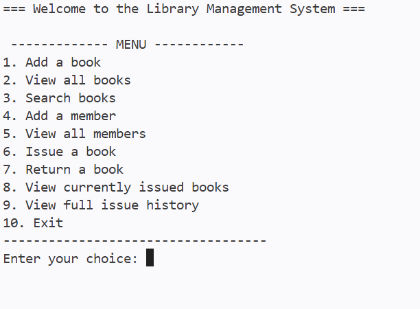
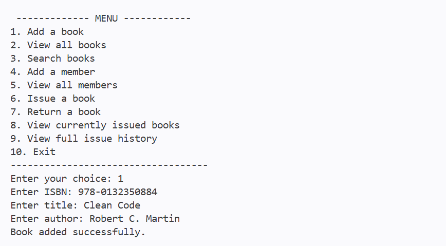
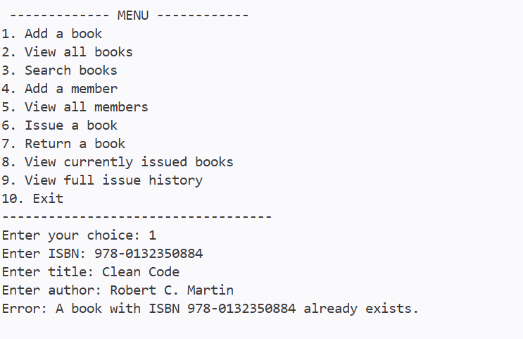
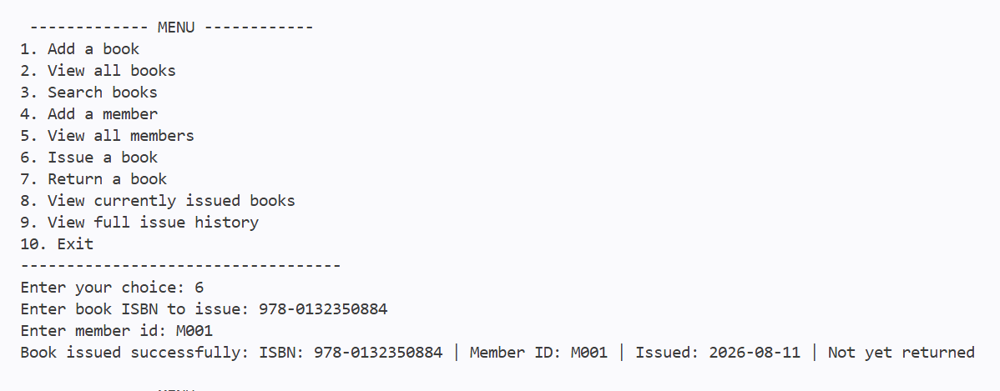
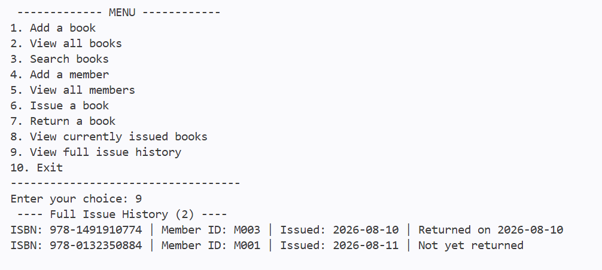

# Library Management System (Java)

A console-based Library Management System built with Core Java. This project allows a librarian/admin to manage books and members, and to handle book issuing and returns — with data persisted across sessions using file handling.

Built as a portfolio project to demonstrate Core Java fundamentals: Object-Oriented Programming, collections, custom exception handling, and file I/O — without relying on any external frameworks or libraries.

**Repository:** https://github.com/Srutee48/library-management-system-java

---

## Features

- **Add a book** — with duplicate ISBN prevention
- **View all books** — with real-time availability status
- **Search books** — by title, author, or ISBN (partial, case-insensitive match)
- **Add a library member** — with auto-generated member IDs
- **View all members**
- **Issue a book to a member** — validates that the book exists, the member exists, and the book is available before issuing
- **Return a book** — updates availability and issue history
- **View currently issued books** — active (not yet returned) issue records
- **View full issue history** — includes both active and returned records
- **Input validation** — prevents empty input, invalid numbers, duplicate ISBNs, issuing nonexistent/unavailable books, and returning nonexistent issue records
- **File-based persistence** — books, members, and issue records are saved to disk and automatically reloaded on the next run
- **Safe exit** — saves all data before closing

---

## Technologies Used

- **Java 21** (Core Java only — no external libraries or frameworks)
- **OOP principles** — encapsulation, abstraction, composition
- **Collections** — `ArrayList`
- **Custom checked exceptions** — `DuplicateISBNException`, `BookNotFoundException`, `MemberNotFoundException`, `BookUnavailableException`
- **File I/O** — `BufferedReader` / `BufferedWriter` with try-with-resources, pipe-delimited (`|`) text file storage
- **`java.time.LocalDate`** for issue/return dates
- Compiled and run with plain `javac` / `java` — no Maven or build tool required

---

## Folder Structure

```
LibraryManagementSystem/
├── src/
│   └── com/
│       └── library/
│           ├── model/
│           │   ├── Book.java
│           │   ├── Member.java
│           │   └── IssueRecord.java
│           ├── service/
│           │   └── Library.java
│           ├── util/
│           │   ├── FileManager.java
│           │   └── InputHelper.java
│           ├── exception/
│           │   ├── DuplicateISBNException.java
│           │   ├── BookNotFoundException.java
│           │   ├── MemberNotFoundException.java
│           │   └── BookUnavailableException.java
│           └── Main.java
├── data/
│   ├── books.txt
│   ├── members.txt
│   └── issued.txt
├── .gitignore
└── README.md
```

**Design notes:**
- `model` classes (`Book`, `Member`, `IssueRecord`) are plain data holders with encapsulated fields.
- `service.Library` contains all business logic and validation rules.
- `util.FileManager` handles only file reading/writing — it has no knowledge of business rules, keeping persistence logic separate from business logic.
- `util.InputHelper` centralizes all console input validation behind one shared `Scanner`.
- `exception` package contains custom checked exceptions, each representing one specific, recoverable failure case.

---

## How to Run the Application

### Prerequisites
- Java Development Kit (JDK) 21 or later installed
- Terminal / Command Prompt access

### Steps

1. Clone the repository:
   ```
   git clone https://github.com/Srutee48/library-management-system-java.git
   cd library-management-system-java
   ```

2. Compile all source files:

   **Command Prompt (Windows):**
   ```
   dir /s /b src\*.java > sources.txt
   javac -d out @sources.txt
   ```

   **PowerShell:**
   ```
   javac -d out (Get-ChildItem -Recurse -Filter *.java src | ForEach-Object { $_.FullName })
   ```

   **macOS / Linux:**
   ```
   find src -name "*.java" > sources.txt
   javac -d out @sources.txt
   ```

3. Run the application:
   ```
   java -cp out com.library.Main
   ```

4. Use the on-screen menu to add books, add members, issue/return books, and search. All data is automatically saved to the `data/` folder when you exit (option 10), and reloaded the next time you run the program.

---

## Sample Screenshots

**Main Menu**


**Adding a Book**


**Duplicate ISBN Validation**


**Issue a Book**


**Full Issue History**


---

## Future Improvements

- Replace flat text-file storage with a relational database (e.g., MySQL) via JDBC
- Add fine/late-fee calculation based on issue and due dates
- Add a due date and reminder system (currently only issue/return dates are tracked)
- Support editing and deleting existing books/members
- Add unit tests (JUnit) for `Library`'s business logic
- Store direct object references between `IssueRecord` and `Book`/`Member` instead of ID-based lookups, for improved performance at scale
- Add a simple GUI (JavaFX) as an alternative to the console interface

---

## Author

Built by [Srutee48](https://github.com/Srutee48) as a portfolio project demonstrating Core Java, OOP design, exception handling, and file-based persistence.
